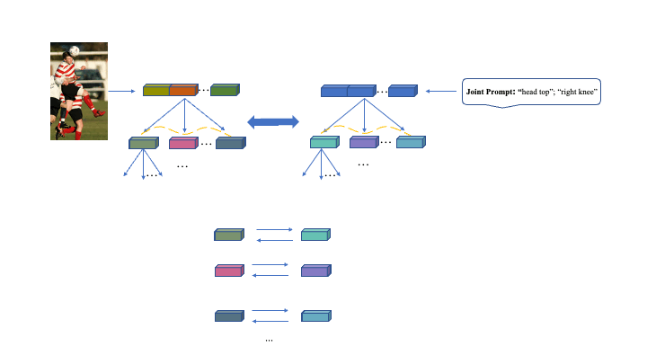

# Parse Graph-Based Visual-Language Fusion for Human Pose Estimation (PGVL)


# Main Results
## Results on CrowdPose test dataset
| Method            | Input size | Backbone |    AP |config|log|weight|
|--------------------|------------|--------|-------|----|----|-------|
| Ours    |    256x192   |   ViT-B | 0.682  |[config](PGVL/configs/body/2d_kpt_sview_rgb_img/topdown_heatmap/crowdpose/PGVL_ViTB_crowdpose_256X192.py)|[log](https://huggingface.co/shhibbnglulul/PGVL/blob/main/20250415_053751.log)|[weight](https://huggingface.co/shhibbnglulul/PGVL/blob/main/best_AP_epoch_210.pth)

## Results on MPII val dataset without multi-scale testing
| Method            | Input size | Backbone |    PCKh@0.5 |config|log|weight|
|--------------------|------------|--------|-------|----|----|-------|
| Ours    |    256x256   |   ViT-B | 0.917  |[config](PGVL/configs/body/2d_kpt_sview_rgb_img/topdown_heatmap/mpii/PGVL_ViTB_mpii_256x256.py)|[log](https://huggingface.co/shhibbnglulul/PGVL/blob/main/20250403_111605.log)|[weight](https://huggingface.co/shhibbnglulul/PGVL/blob/main/best_PCKh_epoch_210.pth)

## Results on OCHuman val dataset
| Method            | Input size | Backbone |   AP |config|log|weight|
|--------------------|------------|--------|-------|----|----|-------|
| Ours    |    256x192   |   ViT-B | 0.628  |[config](PGVL/configs/body/2d_kpt_sview_rgb_img/topdown_heatmap/ochuman/PGVL_ViTB_OCHuman_256x192.py)|[log](https://huggingface.co/shhibbnglulul/PGVL/blob/main/20250405_021127.log)|[weight](https://huggingface.co/shhibbnglulul/PGVL/blob/main/best_AP_epoch_210.pth)


## Results on AP-10K val dataset
| Method            | Input size | Backbone |    AP |config|log|weight|
|--------------------|------------|--------|-------|----|----|-------|
| Ours    |    256x256   |   ViT-L | 0.821  |[config](PGVL/configs/animal/2d_kpt_sview_rgb_img/topdown_heatmap/ap10k/PGVL_ViTL_ap10k_256x256.py)|[log](https://huggingface.co/shhibbnglulul/PGVL/blob/main/20250412_112030.log)|[weight](https://huggingface.co/shhibbnglulul/PGVL/blob/main/best_AP_epoch_140.pth)

### Results on AnimalPose val dataset
| Method            | Input size | Backbone |    AP |config|log|weight|
|--------------------|------------|--------|-------|----|----|-------|
| Ours    |    256x256   |   ViT-B | 0.793  |[config](PGVL/configs/animal/2d_kpt_sview_rgb_img/topdown_heatmap/animalpose/PGVL_ViTB_animalpose_256x256.py)|[log](https://huggingface.co/shhibbnglulul/PGVL/blob/main/20250412_154812.log)|[weight](https://huggingface.co/shhibbnglulul/PGVL/blob/main/best_AP_epoch_200.pth)


# Quick start
## Dependencies installation & data preparation
Please refer to mmpose (https://github.com/open-mmlab/mmpose) and CLAMP (https://github.com/xuzhang1199/CLAMP)

## Training
```
bash tools/dist_train.sh configs/body/2d_kpt_sview_rgb_img/topdown_heatmap/mpii/PGVL_ViTB_mpii_256x256.py 2 "0,1"
```

## Testing
```
bash tools/dist_test.sh  configs/body/2d_kpt_sview_rgb_img/topdown_heatmap/mpii/PGVL_ViTB_mpii_256x256.py checkpoint_path 1 "0"
```


# Citation
If you use our code or models in your research, please cite with:
```
@article{PGVL,
  title={Parse Graph-Based Visual-Language Interaction for Human Pose Estimation},
  author={Liu, Shibang and Xie, Xuemei and Shi, Guangming},
  journal={arXiv preprint arXiv:2509.07385},
  year={2025}
}
```


