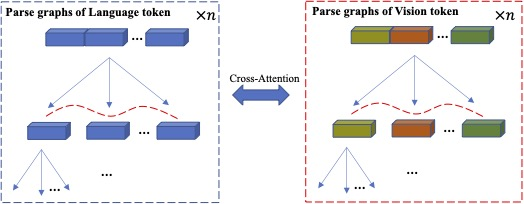

# Parse Graph-Based Visual-Language Fusion for Human Pose Estimation (PGVL)


# Main Results
## Results on COCO val2017 with detector having human AP of 56.4 on COCO val2017 dataset
| Method            | Input size | Backbone |    AP |config|log|weight|
|--------------------|------------|--------|-------|----|----|-------|
| Ours    |    256x192   |   ViT-B | 0.747  |[config](PGVL/configs/body/2d_kpt_sview_rgb_img/topdown_heatmap/coco/PGVL_ViTB_coco_256X192.py)|[log](https://huggingface.co/shhibbnglulul/PGVL/blob/main/20241220_225929_coco_ViT_B.log)|[weight](https://huggingface.co/shhibbnglulul/PGVL/blob/main/best_AP_epoch_210_coco_ViT_B.pth)
| Ours    |    256x192   |   ViT-L | 0.770  |[config](PGVL/configs/body/2d_kpt_sview_rgb_img/topdown_heatmap/coco/PGVL_ViTL_coco_256X192.py)|[log](https://huggingface.co/shhibbnglulul/PGVL/blob/main/20241224_154254_COCO_VIT_L.log)|[weight](https://huggingface.co/shhibbnglulul/PGVL/blob/main/best_AP_epoch_190_COCO_VIT_L.pth)

## Results on CrowdPose test dataset
| Method            | Input size | Backbone |    AP |config|log|weight|
|--------------------|------------|--------|-------|----|----|-------|
| Ours    |    256x192   |   ViT-B | 0.678  |[config](PGVL/configs/body/2d_kpt_sview_rgb_img/topdown_heatmap/crowdpose/PGVL_ViTB_crowdpose_256X192.py)|[log](https://huggingface.co/shhibbnglulul/PGVL/blob/main/20241219_211951_CP_VIT_B.log)|[weight](https://huggingface.co/shhibbnglulul/PGVL/blob/main/best_AP_epoch_200__CP_VIT_B.pth)

## Results on MPII val dataset without multi-scale testing
| Method            | Input size | Backbone |    PCKh@0.5 |config|log|weight|
|--------------------|------------|--------|-------|----|----|-------|
| Ours    |    256x256   |   ViT-B | 0.914  |[config](PGVL/configs/body/2d_kpt_sview_rgb_img/topdown_heatmap/mpii/PGVL_ViTB_mpii_256x256.py)|[log](https://huggingface.co/shhibbnglulul/PGVL/blob/main/20250111_141721_MPII_VIT_B.log)|[weight](https://huggingface.co/shhibbnglulul/PGVL/blob/main/best_PCKh_epoch_200_MPII_VIT_B.pth)

## Results on AP-10K val dataset
| Method            | Input size | Backbone |    AP |config|log|weight|
|--------------------|------------|--------|-------|----|----|-------|
| Ours    |    256x256   |   ViT-B | 0.780  |[config](PGVL/configs/animal/2d_kpt_sview_rgb_img/topdown_heatmap/ap10k/PGVL_ViTB_ap10k_256x256.py)|[log](https://huggingface.co/shhibbnglulul/PGVL/blob/main/20241224_231343__AP10K_VIT_B.log)|[weight](https://huggingface.co/shhibbnglulul/PGVL/blob/main/best_AP_epoch_210_AP10K_VIT_B.pth)
| Ours    |    256x256   |   ViT-L | 0.822  |[config](PGVL/configs/animal/2d_kpt_sview_rgb_img/topdown_heatmap/ap10k/PGVL_ViTL_ap10k_256x256.py)|[log](https://huggingface.co/shhibbnglulul/PGVL/blob/main/20241219_182059.log)|[weight](https://huggingface.co/shhibbnglulul/PGVL/blob/main/best_AP_epoch_185.pth)

### Results on AnimalPose val dataset
| Method            | Input size | Backbone |    AP |config|log|weight|
|--------------------|------------|--------|-------|----|----|-------|
| Ours    |    256x256   |   ViT-B | 0.790  |[config](PGVL/configs/animal/2d_kpt_sview_rgb_img/topdown_heatmap/animalpose/PGVL_ViTB_animalpose_256x256.py)|[log](https://huggingface.co/shhibbnglulul/PGVL/blob/main/20241224_192746_AnimalPose_VIT_B.log)|[weight](https://huggingface.co/shhibbnglulul/PGVL/blob/main/best_AP_epoch_200_AnimalPose_VIT_B.pth)


# Quick start
## 1. Dependencies installation & data preparation
Please refer to mmpose (https://github.com/open-mmlab/mmpose) and CLAMP (https://github.com/xuzhang1199/CLAMP)

## Training
```
bash tools/dist_train.sh configs/body/2d_kpt_sview_rgb_img/topdown_heatmap/mpii/PGVL_ViTB_mpii_256x256.py 2 "0,1"
```

## Testing
```
bash tools/dist_test.sh  configs/body/2d_kpt_sview_rgb_img/topdown_heatmap/mpii/PGVL_ViTB_mpii_256x256.py checkpoint_path 1 "0"
```


# Citation
If you use our code or models in your research, please cite with:
<!-- ```
@article{PGBS,
	title={Human Pose Estimation via Parse Graph of Body Structure},
	author={Liu, Shibang and Xie, Xuemei and Shi, Guangming},
	journal=TCSVT,
	year={2024},
	publisher={IEEE}
}

```  -->
